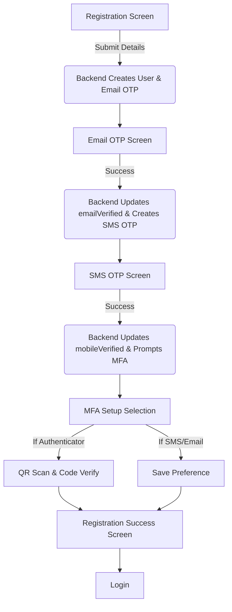
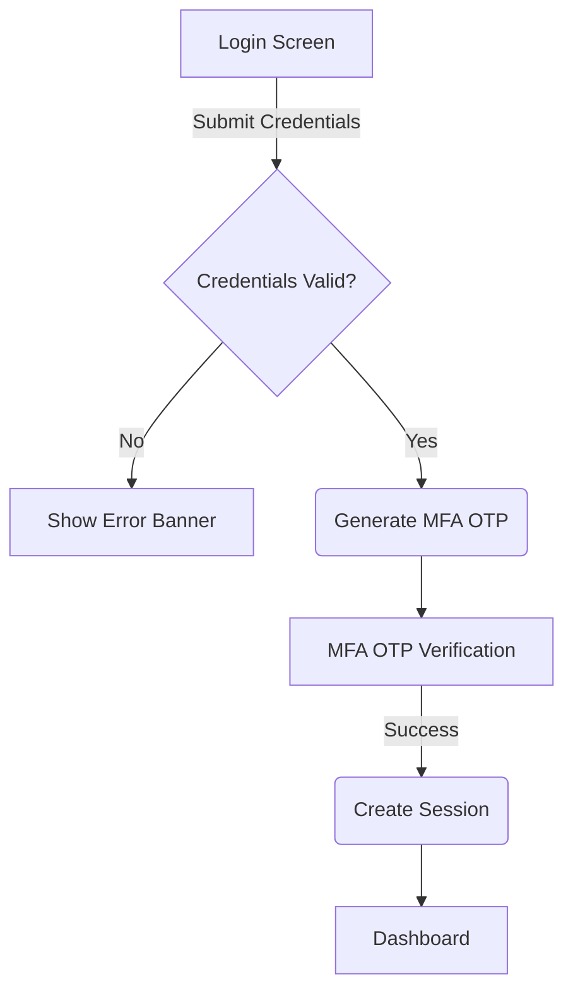

# SecureID Authentication System

SecureID is an internship assignment project that demonstrates foundational Identity and Access Management (IAM) concepts. It provides a complete authentication workflow including Registration, Login, Multi-Factor Authentication (MFA), Session Management, and JWT validation.

## 1. Project Overview
This project simulates a secure identity platform. It is built entirely with vanilla web technologies (HTML, CSS, JS) on the frontend and Node.js on the backend, intentionally avoiding modern frameworks and databases to demonstrate core web development and security fundamentals.

## 2. IAM Concepts Used
- **Authentication**: Verifying user identity via passwords.
- **Multi-Factor Authentication (MFA)**: Enhancing security by requiring an additional proof of identity (Email OTP, SMS OTP, or Authenticator app).
- **Session Management**: Keeping users logged in securely using HttpOnly cookies.
- **Token-based Authorization**: Using JSON Web Tokens (JWT) for secure, stateless API access.

## 3. Registration Flow Diagram


## 4. Login Flow


## 5. MFA Flow Explanation
Multi-Factor Authentication (MFA) adds a critical layer of security to the standard username/password flow. In this project:
- **Setup**: After confirming their contact details (Email/Mobile) during registration, the user must explicitly choose an MFA method. If they select **Authenticator App**, they are shown a simulated QR code and manual setup key, and must verify it with a 6-digit code.
- **Verification**: On all subsequent logins, after standard credentials are provided, the user is challenged with an OTP corresponding to their chosen MFA method before the secure session cookie is established.

## 6. OTP System
- OTPs are strictly generated on the backend.
- Stored temporarily in `otpChallenges.json` with a 3-minute expiry.
- Tracked for a maximum of 3 attempts.
- Delivery is simulated via terminal console logs.

## 7. Session Authentication & Dashboard Explanation
- Achieved using `express-session`.
- Session IDs are stored in `HttpOnly`, `Strict` SameSite cookies to protect against XSS and CSRF attacks.
- Protects the `/dashboard` and `/profile` views as well as the `/api/me` route.
- **Dashboard UI**: When the dashboard loads, it requests `/api/me`, authenticates via the session cookie, and retrieves the user's `emailVerified` and `mobileVerified` statuses. These statuses are dynamically rendered with success checks, proving the registration state persists across sessions.

## 8. JWT Demonstration Explanation
While standard interactions use session cookies, modern applications often require stateless tokens (JWTs) for mobile apps or external API integrations. 
- **The Demo**: On the dashboard, clicking "Test JWT Auth" first hits `/api/token`. The backend verifies the existing session cookie and issues a stateless JSON Web Token valid for 1 hour.
- The frontend then takes this token and makes an explicit request to `/api/protected` passing the token in the `Authorization: Bearer <token>` header.
- Upon successful validation by the backend middleware, a success modal is triggered, proving the token's validity.

## 9. Folder Structure
```
secureid/
├── public/
│   ├── css/style.css
│   └── js/
│       ├── api.js
│       └── main.js
├── views/
│   ├── login.html
│   ├── register.html
│   ├── otp.html
│   ├── mfa-setup.html
│   └── dashboard.html
├── data/
│   ├── users.json
│   └── otpChallenges.json
├── routes/
│   └── authRoutes.js
├── middleware/
│   └── authMiddleware.js
├── docs/
│   └── project-summary.md
├── server.js
└── package.json
```

## 10. Technologies Used
- **Frontend**: HTML5, CSS3, Vanilla JavaScript
- **Backend**: Node.js, Express.js
- **Security**: bcryptjs, jsonwebtoken, express-session

## 11. Why Each Technology Was Chosen
- **Vanilla HTML/CSS/JS**: To demonstrate fundamental understanding of the DOM, fetch API, and CSS without relying on abstractions like React or Tailwind.
- **Node.js/Express**: Extremely lightweight and perfect for building simple RESTful APIs.
- **JSON Storage**: Chosen over a database to keep the project completely portable and focused strictly on the authentication flow logic.

## 12. Security Measures Implemented
- Passwords are never stored in plaintext (bcrypt).
- Session cookies are HttpOnly to prevent XSS theft.
- OTPs are hashed in storage to prevent leakage if the data file is compromised.
- OTPs have strict expiration and attempt limits.
- Sensitive routes require active authentication state.

## 13. How To Run Locally
1. Clone the repository.
2. Run `npm install`.
3. Run `node server.js` or `npm start`.
4. Open `http://localhost:3000` in your browser.
5. Watch the terminal for simulated Email/SMS OTP codes during registration and login.

## 14. API Endpoints
- `POST /api/register`
- `POST /api/login`
- `POST /api/login/mfa-select`
- `POST /api/otp/verify`
- `POST /api/otp/resend`
- `POST /api/mfa/setup`
- `GET /api/me` (Session required)
- `POST /api/logout`
- `POST /api/token` (Session required)
- `GET /api/protected` (JWT required)

## 15. Final Assignment Compliance Checklist

| Feature | Status | Notes |
|---------|--------|-------|
| Registration Form | ✅ Completed | Fully matches assignment design; all fields validated. |
| Registration Validation | ✅ Completed | Passwords match checking, strength tracking, terms verification. |
| Email OTP Flow | ✅ Completed | Auto-moves cursor, handles errors, expires, resends. |
| SMS OTP Flow | ✅ Completed | Mirrors Email OTP, triggers after email success. |
| MFA Setup Selection | ✅ Completed | Dedicated screen for Email, SMS, or Authenticator selection. |
| Authenticator QR UI | ✅ Completed | Renders simulated QR code block correctly. |
| MFA Verification UI | ✅ Completed | 6-digit input correctly implemented. |
| Registration Success | ✅ Completed | Displays all 3 verification checklist items exactly as requested. |
| Login Error States | ✅ Completed | Invalid credentials return a visual red banner. |
| Login MFA Choose Method | ✅ Completed | New UI (`login-mfa-select.html`) explicitly prompts method selection. |
| OTP Resend | ✅ Completed | Successfully regenerates OTP via backend and resets timer. |
| Max Attempts Locking | ✅ Completed | Kills OTP challenge and locks UI button after 3 failed tries. |
| Dashboard UI | ✅ Completed | Dynamically maps `user.emailVerified` from session to status checks. |
| Profile Page (`/profile`) | ✅ Completed | Dedicated profile page fetching `GET /api/me`. |
| JWT Demonstration | ✅ Completed | Token requests to `/api/protected` launch the success modal. |
| Visual Compliance | ✅ Completed | Split-screen design, exact typography, layout padding, and color matching. |
| Password Hashing | ✅ Completed | Utilizes `bcryptjs`. |
| Security | ✅ Completed | JSON storage, HttpOnly cookies, no plain OTPs (except transiently for the test endpoint). |

### TEST / EVALUATOR ONLY: OTP Retrieval
Since the system simulates email/SMS delivery via the local terminal (which is inaccessible when deployed on Vercel), a **test-only** mechanism has been added for evaluators.

1. Register or Log in through the deployed Vercel website.
2. Capture the `challengeId` returned by the backend API in the network tab (or browser session storage).
3. Open a new tab and send a request to:
   `GET /api/test/otp/{challengeId}`
4. Use the returned `otp` in the website's verification input.

> **Note**: The OTP retrieved from this endpoint still expires after 3 minutes and remains fully subject to all normal verification rules (maximum attempts, hash matching). It does not bypass the system's logic.

## 16. Future Improvements
- Integrate an actual database (e.g., PostgreSQL or MongoDB).
- Send real emails using SendGrid or AWS SES.
- Send real SMS using Twilio.
- Implement real TOTP verification for the Authenticator app setup.
